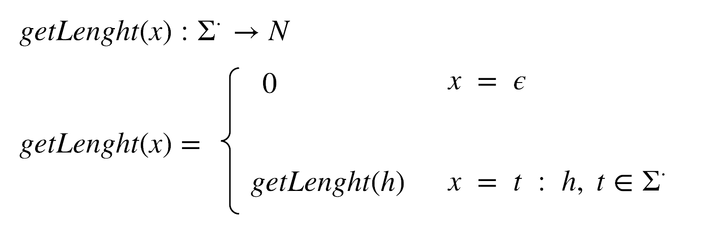

# Parte II - Strings

## Funciones

#### getLength()



### isEmpty()

```hs
isEmpty :: Sigma* -> Boolean

let isEmpty(a), a in Sigma* / {a = {a_0, a_1, ..., a_n} : n in N : isEmpty(a) = True if n = 0 & a_0 = lambda; isEmpty(a) = False if n not 0 }
```

### isEqualTo()

```hs
isEqual:: Sigma* x Sigma* -> Boolean

let isEqual (a, b); a, b in Sigma* / a = {a_0, a_1, ..., a_n}, b = {b_0, b_1, ..., b_m} : n, m in N : isEqual(a, b) = true <-> a_i = b_i for all i in N;
```

### Power()

```hs
Power :: Sigma* X N -> Sigma*

let Power(a, m) / {a = {a_0, a_1, ..., a_n} : n in N : Power (a) = b, b in  Sigma* : b = append(a, a) and |b| = (|a|) (m)} }
```

### append()

```hs
append :: Sigma* X Sigma* -> Sigma*

let append(a, b) a, b in Sigma* / {a = {a_0, a_1, ..., a_n}, b = {b_0, b_1, ..., b_m} : n, m in N : append(a, b) = c, c in Sigma* : c = {a_0, a_1, ..., a_n, b_0, ..., b_m,}}
```
