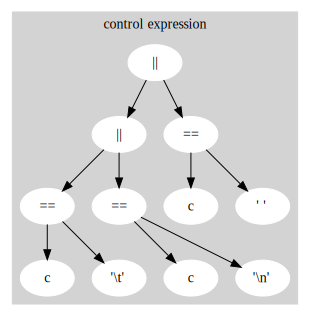
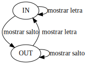

# 05 - wl

## Arboles

### Inicializacion de Contadores


### Expresiones de Control



## Maquina de Estado




### Definicion formal

```
{Q, E, T, out, F}

Q = {in, out}
E = {ASCII}
T : Q X E -> Q
F = {in, out}
```

### Switch - Enum

El usar un *typedef* para el *state* permite el encapsulamiento, mayor comprension del contexto y por ende mas legibilidad; sin embargo a cambio tenemos un codigo mas extenso; esto se ve claramente si comparamos:

```c
if( c == ' ' || c == '\n' || c == '\t');
```

Con

```c
switch(c){
    case '\n':
    case '\t':
    case ' ':
    default:
}
```


### Goto

Si bien, generalmente, se desalienta el uso del goto. Este puede resultar util para:

- Salir de *nested loops*: goto resulta mas limpio y a diferencia del *break keyword* permite salir de todos los loops y no solo de uno.

- Performance: Si bien esto es una espada de doble filo, ya que los compiladores no pueden optimizar gotos, estos se ejecutan relativamente mas rapidos.

- Legibilidad: permiten un codigo mas amigable a la vista, probablemente en menos lineas.