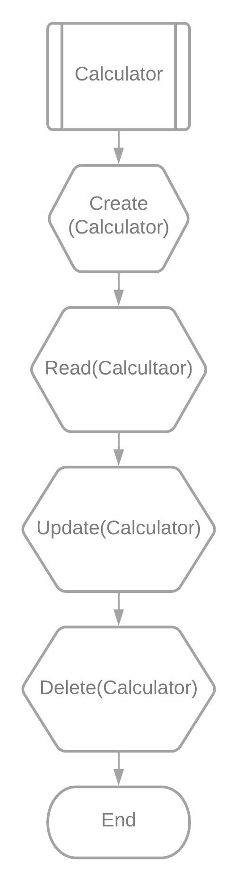
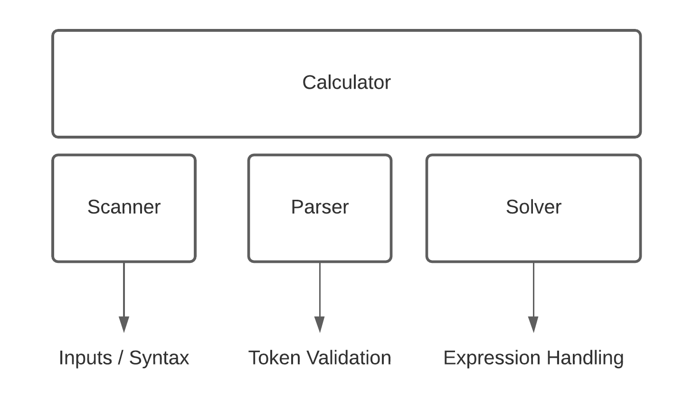

# Calculadora Infima V2

Esta nueva version ahora permitira no solo resolver expresiones `"a+b"` sino tambien `(a+b)+c` e incluso restas y multiplicaciones.

## Funcionamiento

Al igual que su antecesora, reuso el concepto **CRUD**, y utilizo el concepto de Calculadora como interfaz y canal de comunicacion entre todos los diferentes modulos.



Para esta version, se agrego un nuevo componente, el *Solver*, quedando:



### Scanner

El scanner es un modulo de la calculdora, encargado del permitir el ingreso de expresiones y realizar un analisis sintactico a las mismas.

#### Metodologia del Scanner

Utilizara `getchar()` para recepcionar caracteres hasta detectarse un  `eof` o `'\n'`. Luego, verificara si la sintaxis es correcta e intentara corregir pequeños errores; por ejemplo *inputs* como: `"0000010"` o `"++++"` se auto-corregiran a `'10'` y `'+'` respectivamente.

#### Diseño Scanner

```c

/*Sintax error types*/
typedef enum Syntax_Error{
    INVALID_OPERATOR = -1,
    NONE,
    NON_DECIMAL,
    MULTIPLE_OPERATORS
}syntax_error_t;

/*Input handler*/
typedef struct Scanner {
    /*Input buffer*/
    char ibuffer[buffer_size];
    int index, tokens;
    sflags_t flags;
    /*Errors detected*/
    syntax_error_t error;
} scanner_t;

```

### Parser

Este modulo solo entrara en ejecucion si se detecto almenos un *token*.

#### Metodologia del Parser

El parser ira recibiendo tokens desde la calculadora, la cual obtendra a su vez los tokens del scanner con `getNextToken()`.

Con los tokens obtenidos se hara una lista enlazada, donde se analizara que tipo de token es, y si es correcto o no.

#### Diseño Parser

```c
typedef enum token{
    INVALID = -1,
    OPERATOR,
    OPERAND,
    OPERANDV,
    PARENTHESIS,
    EOL
}token_t;

typedef struct pToken{
    int index;
    bool valid;
    token_t type;
    char str[buffer_size];
}ptoken_t;

typedef struct Parser{
    t_list * token_list;
    ptoken_t * read_token;
    token_t previous_token;
}parser_t;
```

### Solver

Finalmente, el *Solver* se encargara de resolver las expresiones con los tokens parseados.

#### Metodoliga del Solver

El modulo recibira un *token* parseado, que se obtenido del *Paser* a travez de una calculadora. Basado en el *Shunting-yard algorithm*, se encargara de apilar en un *Stack* los operadores y en una encolar en una *Queue* los operandos, teniendo en cuenta tratamientos de parentesis y precendencia de operadores, para obtener una notacion Polaca Postfija.

Luego se resolvera volcando toda el *Stack* sobre la *Queue* y desencolando la misma: Si se desencolo un operando se lo apila nuevamente; si resulto un operador, se desapilan los ultimos dos operandos y se resuelve la expresion.